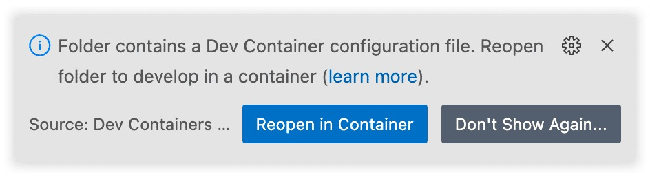
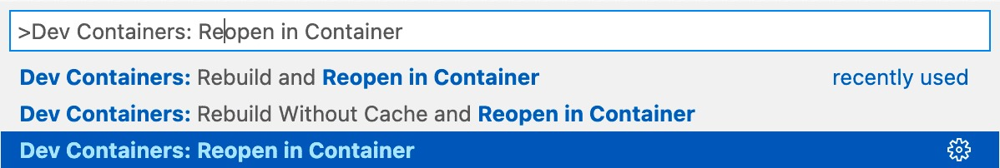
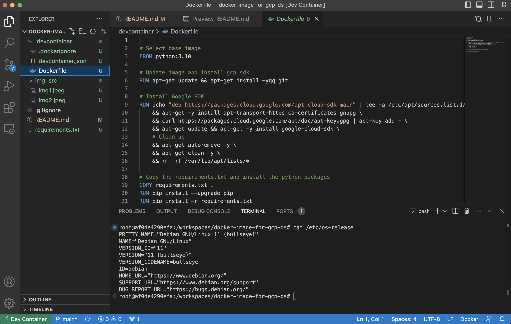

# Docker Image for GCP and Dev Containers [WIP]
This repo contains a docker image and the code needed for create it with most common packages used for a GCP data scientist.

## Getting Started
1. Install [Docker Desktop](https://www.docker.com/products/docker-desktop).
2. Install [Visual Studio Code](https://code.visualstudio.com/).
3. Install the [Dev Containers extension](https://marketplace.visualstudio.com/items?itemName=ms-vscode-remote.remote-containers).

## Opening the Devcontainer
Since all instructions on how to configure your dev environment are now defined in a Dockerfile, users can open up your Devcontainer with just one button:

First, make sure you have the [Dev Containers extension](https://marketplace.visualstudio.com/items?itemName=ms-vscode-remote.remote-containers) installed in VSCode. That done, if you open your repo again, the extension should already detect your Devcontainer:

Alternatively, you can open up the command palette (CMD + Shift + P) and select “Dev Containers: Reopen in Container”:

VSCode is now connected to the Docker container.

## Container customization
In order to customize the container, you should modify the `requirements.txt` and/or `Dockerfile`.

## Useful External Links
* [DevContainer templates](https://containers.dev/templates).
* [How to create a devcontainer for your Python project](https://godatadriven.com/blog/how-to-create-a-devcontainer-for-your-python-project-%F0%9F%90%B3/).
* [VSCode docs](https://code.visualstudio.com/docs/devcontainers/containers).
* [DevContainer VSCode github](https://github.com/microsoft/vscode-dev-containers).

